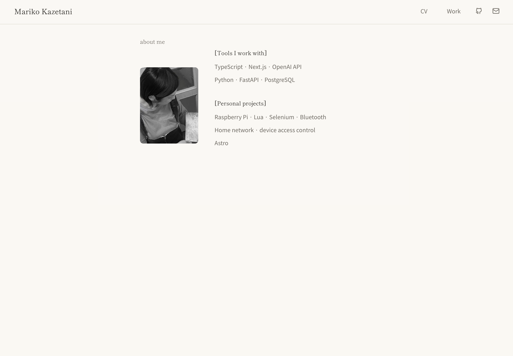
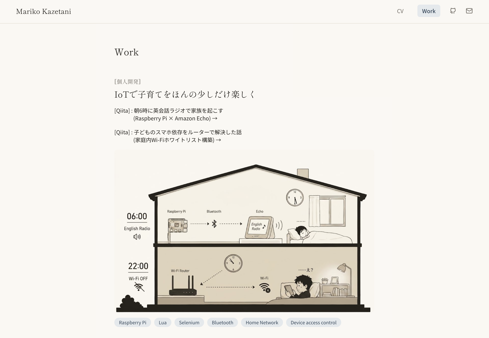

# kazec-m.github.io

Mariko Kazetaniのポートフォリオサイトです。

**公開URL** → https://kazec-m.github.io

<table>
  <tr>
    <td></td>
    <td></td>
  </tr>
</table>
<!-- 撮れたら、リポジトリ直下に screenshot-about.png / screenshot-work.png として置いてください -->
<!-- Workは1ビューポート分ではなく、1プロジェクト分(動画・説明・タグまで)が写る位置までスクロールしてから撮影 -->

## 使用技術

- [Astro](https://astro.build)
- Tailwind CSS
- GitHub Actions(GitHub Pagesへの自動デプロイ)

スマートフォンで開く場面を想定し、初期表示速度を最優先して選定しました。スクールではNext.js + Express + PostgreSQL + Renderの構成で開発していましたが、無料枠ではRenderのスリープ復帰に数秒〜数十秒かかり、Next.jsも静的なポートフォリオには機能過多でした。静的サイト生成に絞ったAstro + GitHub Pagesに切り替えたことで、サーバーの起動待ちなく即座に表示できる構成になっています。Lighthouseスコアは下記です。

## Lighthouseスコア(2026年9月時点・シークレットモード計測)


## 設計意図

レイアウト面でも一目で伝わることを重視し、About・CVページはヘッダー込みで画面の高さに固定(100svh)しました。和紙のような温かみのある配色と、明朝体・ゴシック体を絞った使い方で、静かで落ち着いた印象にも仕上げています。

## ローカルでの動かし方

```bash
npm install
npm run dev
```

`http://localhost:4321` で確認できます。

## License

MIT